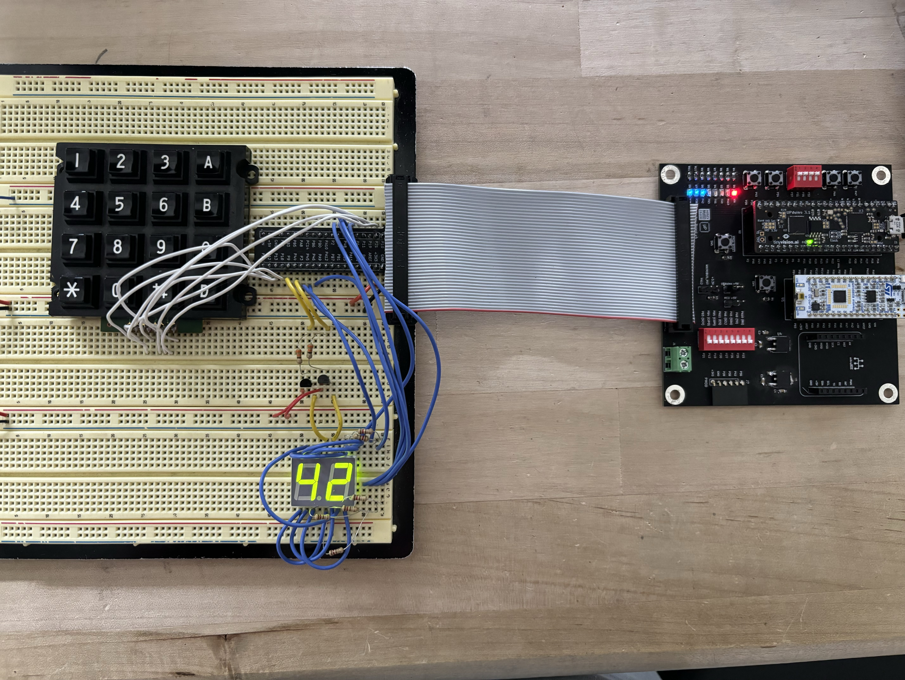

# Lab 3 – Keypad Scanner and Debouncer (FPGA)

This project implements a **4×4 keypad scanner with debouncing logic** on an FPGA.  
The system displays the **most recently pressed key** on the right digit of a dual 7-segment display, while the **previously pressed key** appears on the left.  

## Demo
▶️ [Watch the Keypad Scanner in Action](https://youtube.com/shorts/AxNCW6z_a80?feature=share)

---

## Features & Achievements
- ✅ Implemented a **column-driven scanner FSM**: drives one column LOW at a time while others remain HIGH.  
- ✅ Designed a **debouncer FSM** that generates a one-cycle enable pulse, eliminating switch bounce and double counts.  
- ✅ Solved the **multi-key press issue**: pressing two keys in the same column does not lock the system.  
- ✅ Integrated with a **time-multiplexed 7-segment display** (from Lab 2) to reuse logic efficiently.  
- ✅ Debugged **logic-level issues** (moved from pull-down to pull-up configuration to meet FPGA VIH thresholds).  
- ✅ Verified correctness with **testbenches, waveforms, and full-system simulation**.  

---

## How It Works
A 4×4 matrix keypad connects rows and columns via mechanical switches:  

- The FPGA drives the **columns**, holding all HIGH except one, which is driven LOW.  
- The **rows** are inputs with pull-up resistors.  
- When a key is pressed, the LOW propagates to the corresponding row, allowing the system to detect the key.  
- The **scanner FSM** identifies the column, the **decoder** determines the key, and the **debouncer FSM** ensures clean registration.  
- The display logic updates the previous and current key values on the dual 7-segment display.  

Block Diagram:  

---

## Lessons Learned
- Simulation alone is not enough — hardware debugging with an oscilloscope is critical.  
- Logic thresholds (VIH/VIL) must always be considered when choosing pull-up vs. pull-down designs.  
- Managing active-HIGH vs. active-LOW logic signals is essential to avoid frozen states.  
- FSMs must handle edge cases such as multiple simultaneous key presses. 